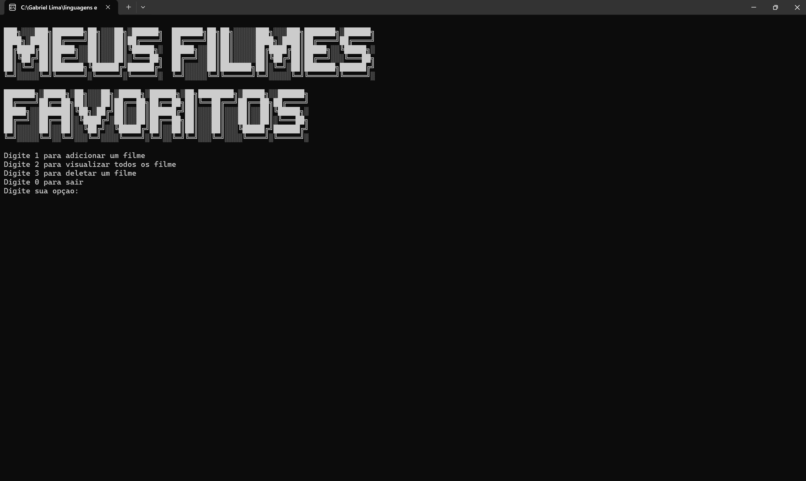
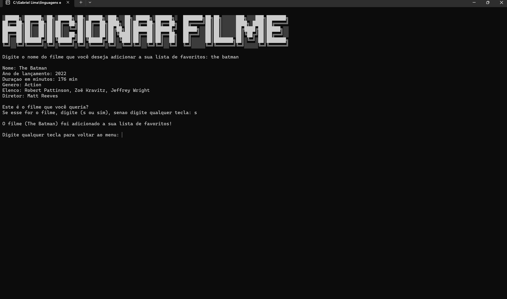
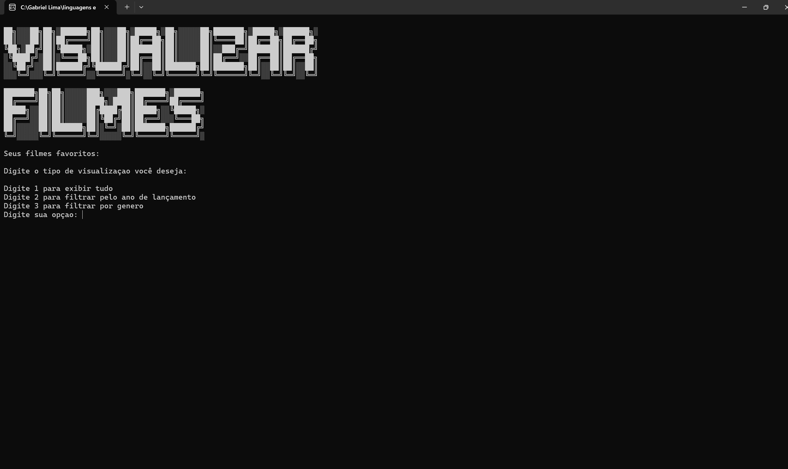
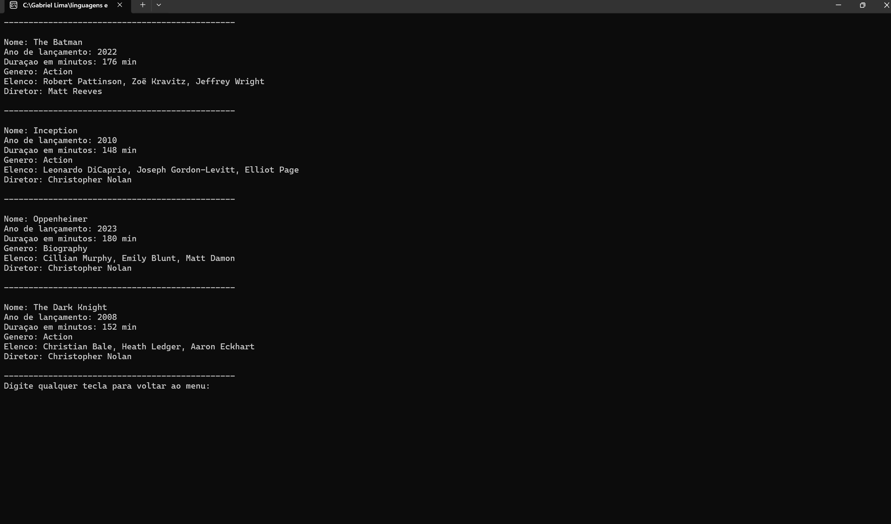
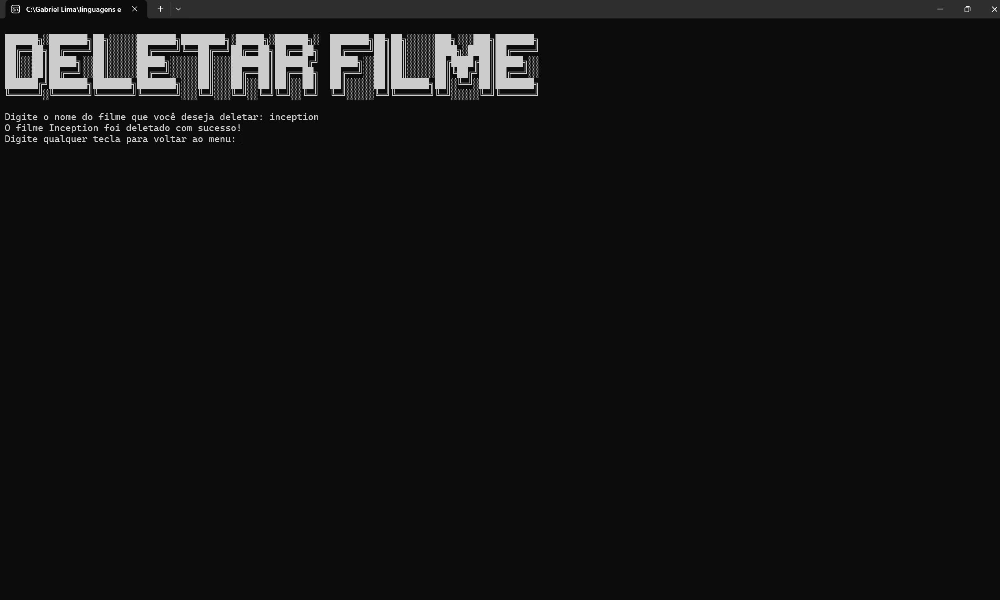
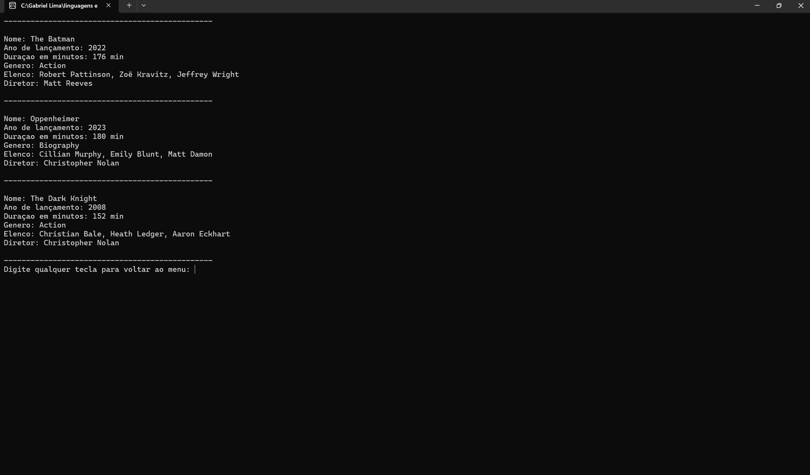

# 🍿 MEUS FILMES FAVORITOS 🍿

## 🔧 Como Funciona?
Ao executar o programa, a primeira coisa que você vê é a tela inicial:

Na tela inicial possue 3 opções:
1. Adicionar um filme a sua lista de favoritos 
2. Visualizar sua lista de filmes 
3. Deletar um filme da sua lista.

Quando digitamos 1, iremos para a tela de Adicionar Filme:

Você pode digitar o nome de qualquer filme que quiser e irá retornar as informações do filme, como: 
- Titulo
- Ano de Lançamento
- Duração em minutos
- Genero
- Elenco
- Diretor 

Mas como isso acontece? Usei uma **API** da OMDb que retorna esses dados para o usuario e pergunta se é realmente esse filme que ele, o usario, está buscando para entrar na sua lista.

Após voltar a tela inicial clicando em qualquer tecla, podemos digitar a opção 2 que leva a visualização dos seus filmes:

Nesta tela, podemos observar que tem mais 3 opções: 
1. Exibir todos os filmes
2. Filtrar por Ano de lençamento 
3. genero 

E é assim que fica a visualização: 

Tras como resultado, todos os seus filmes favoritos que é a opção 1

obs: a opção 2 de filtrar por ano, leva a mais 3 opções:
1. Exibir os filmes que lançaram depois do ano que o usuario digitou
2. Exibir os filmes que lançaram antes do ano que o usuario digitou
3. Exibir os filmes que lançaram no ano que o usuario digitou

Para fazer essa filtragem, utilizei a biblioteca LINQ do C# que me permite manipular esses dados.

E por fim, mas não menos importante, após você voltar ao menu, terá a ultima opção que é a de deletar um filme:

Uma tela simples, porém funcional que faz o seu papel de deletar um filme.

E como podemos ver, o filme foi deletado!

## 💻 O que utilizei nesse projeto?
- Orientação a Objetos com C#
- APi da OMDb
- Biblioteca: LINQ 

## 🤑 Futuras atualizações
No futuro pretendo ampliar o projeto não so para filme mas também para series.

Utilizar um sistema de banco de dados, pode ser com criação de arquivos (.json ou .txt), ou com SQL

Ter mais opções de filtragem, por exemplo: filtragem por nota, por ator, por diretor, etc.

Criar um sistema de avaliação, que o proprio usuario digita sua nota para o filme

E outras coisas que o futuro tem para disponibilizar!

## 🧑‍🦰 Criador
Gabriel Miranda Mucarbel de Lima - @GMiranda21ML © 2024
